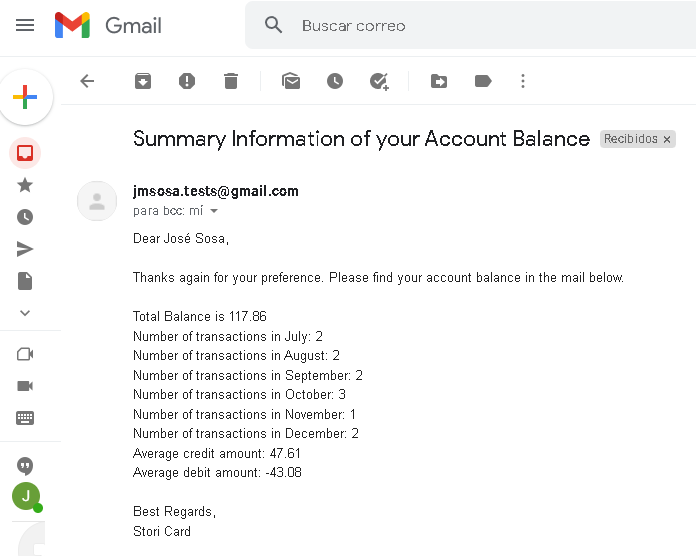

# Balance Email Sender

<!-- TABLE OF CONTENTS -->
## Table of Contents

* [Introduction](#introduction)
* [Code Interface](#code-interface)
  * [Database](#database)
  * [Email](#email)
  * [Transactions](#transactions)
* [How to run this code](#how-to-run-this-code)
  * [Docker](#docker)
  * [Bash Scripts](#bash-scripts)
* [Result](#result)

<!-- INTRODUCTION -->
## Introduction

This repository contains a code challenge from the company Stori Card. It is a backend code system able to process data from a csv file that contains the transaction history of an user and send the summary balance information in the form of an email to that same user.

<!-- CODE INTERFACE -->
## Code Interface

The main function is located in the main.go file at the start of the project folder. It calls different functions from other packages (database, transactions and email) to complete the logic of getting, processing and sending data via an email to a specific user.

As part of this challenge, this project only handles one user information and one list of transactions that we manually associate to that user.

### database

This package contains the functionality to read a csv file and return the data from it in form of a matrix. CSV files simulate the data from users and transactions information. 

As its name indicates, any topic related to databases could be handle by this package in the future, like connections and querys.

### transactions

This package process the data from the txns.csv file in database and returns the total balance, the average debit amount, the average credit amount and the number of transactions per month.

### email

This package works with all topics related to the creation and sending process of an email. It can be split in different targets:
* Process the information of the users from the users.csv file in database to obtain the name and email of the user to send the summary of their balance. 
* Reads the sender.yaml configuration file to obtain the name and email of who is sending the email to the user.
* Creates the body and subject for the email based on the user information and its transaction data.
* Send and email with all the information necessary to the user.

<!-- HOW TO RUN THIS CODE -->
## How to run this code

To run this project, is necessary to complete the next steps:

1. Clone this project in your workspace. You can use the next command:

   ```sh
   git clone https://github.com/jmsp-test/balance-email-sender.git
   ```

2. Modify the user information in /database/users.csv to the name and email of the receiver of the email. Fill it with your own data.

   ```sh
   Id,Name,Email
   0,Your Name,your-email@gmail.com
   ```

3. Modify the sender information in /email/sender.yaml to the email and password of the sender of the email. Fill it with your own data.

   ```sh
   id: 0
   email: "sender-email@gmail.com"
   password: "sender-password"
   ```

4. Build and run the project as described in docker ir bash scripts.

### Docker

1. Create a Docker image named balance-email-sender from the Dockerfile in the project.

    ```sh
    docker build -t balance-email-sender .
    ```

2. Verify that the image was created.

    ```sh
    docker images
    ```

2. Run the image.

    ```sh
    docker run balance-email-sender
    ```

  ### Bash Scripts

1. Run the build.sh file first to download module libraries from go.mod file and build an executable / binary file in a new folder named /build/

    ```sh
    ./build.sh
    ```

2. Run the executable / binary file created.

    ```sh
    ./run.sh
    ```

<!-- RRESULT -->
## Result

The expected result is an email with the summary of the transactions balance sent to the user email from the sender email. 

In the next example, an email was sent to Random Name with email jmsosa-tests@gmail.com from a sender with the same email jmsosa-tests@gmail.com



